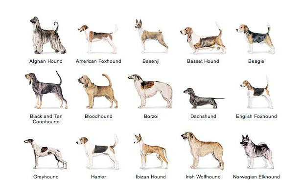

# Dog-Breed-Image-Classification-using-CNN

 

## Business Objectives :

Image classification is the process of taking an input (like a picture) and outputting a class or a probability that the input is a particular class.

The World Canine Organization (FCI) is currently listing more than 300 officially recognised dog breeds. 

The aspiring and astonishing field of Deep Learning and artificial neural networks provides powerful concepts and methods that will help us in this sort of classification tasks. In this project we will develop ideas for a dog identification app using CNNs.

The software is intended to accept any user-supplied image as input. If a dog is detected in the image, it will provide an estimate of the dog’s breed. If a human is detected, it will provide an estimate of the dog breed that is most resembling.

## Data Collection :

The data was provided by Udacity.

Dog Dataset Link: https://s3-us-west-1.amazonaws.com/udacity-aind/dog-project/dogImages.zip 

Humans Link: https://s3-us-west-1.amazonaws.com/udacity-aind/dog-project/lfw.zip

The image data comprises 8351 dog images and 133 separate dog breed names.
and 13233 images from the labeled human faces in the wild dataset.

## Modelling :

The following modelling approach was used in the project:

1. Loading and exploring the images
2. Loading the pre-trained models - ResNet50, InceptionNetv3
3. Customize and fine-tune the pre-trained models
4. Train the models

The detailed analysis and model creation can be found in the .ipynb file. 

## Result :

The result from InceptionNet v3 Models is as below:

Some of the test images are given below.

## Conclusion :

In this project we developed several approaches for the development of an app for the identification of dog breeds, and we achieved our best results with the application of a transfer learning model. We achieved an accuracy of 83% in our tests using InceptionV3 Model. 

We also learned how to build convolution networks from scratch, which was a very educational undertaking, even though we soon realized that there are significantly more promising methods, particularly with the application of transfer learning.

However, we still see several options to further improve our algorithm in the future:
  1. We could gather more training data.
  2. We could employ data augmentation to prevent overfitting.
  3. We could add more layers to make our model more complex and hopefully more powerful.
  4. We could extend our training time and add more epochs to the training.

But all in all, the accuracy levels from our tests, along with the tests with specific sample images, suggest that we already have a serious model we could work with in a real app.
